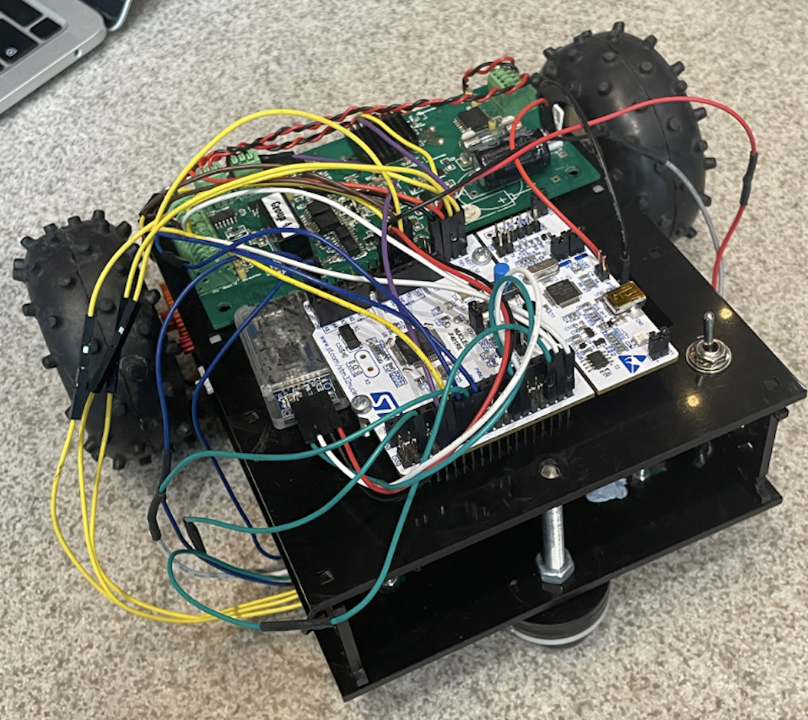
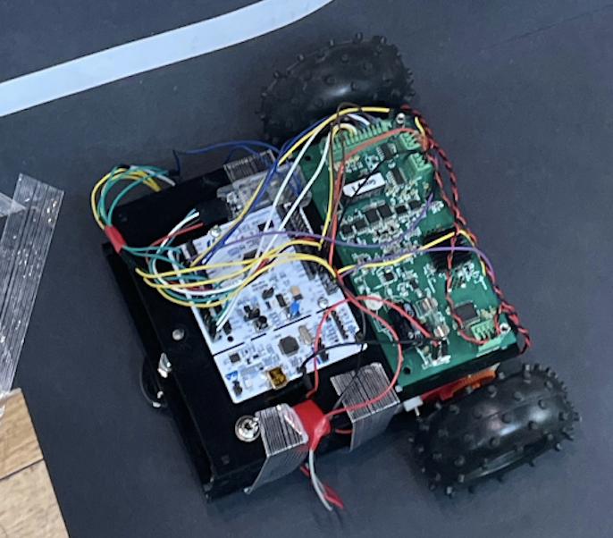
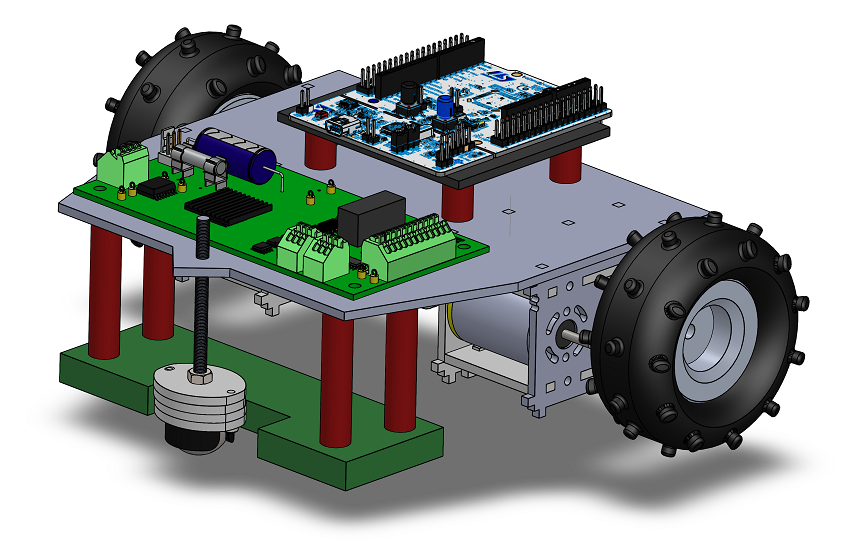
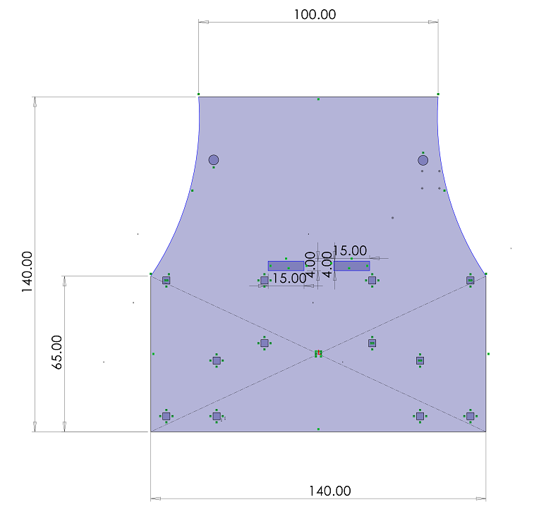
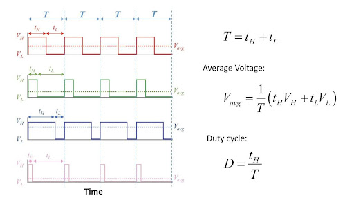
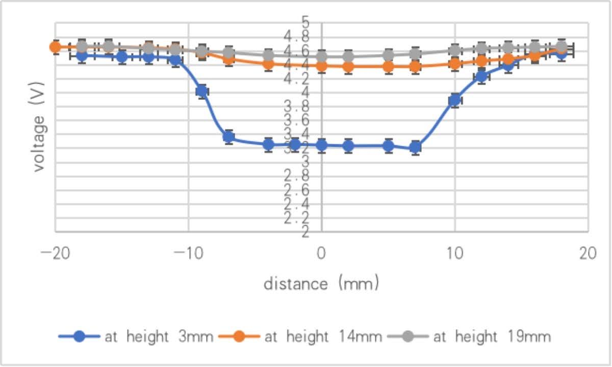
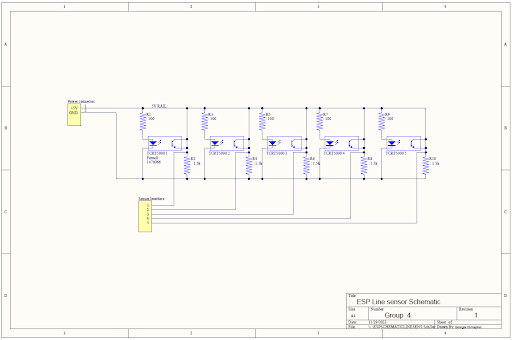
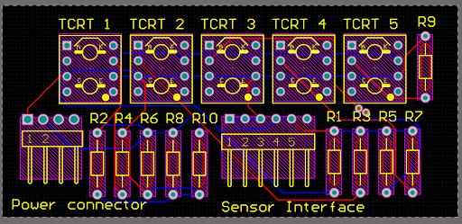
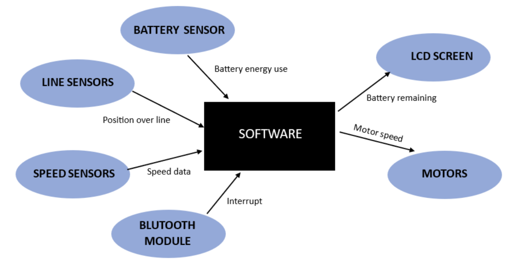
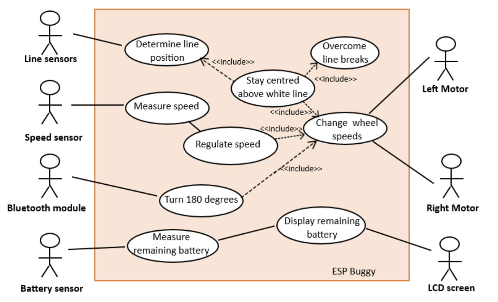

# Autonomous Line-Following Buggy

An embedded systems project that designs and builds an autonomous buggy capable of following a track using optical sensors and motor control algorithms.

This project integrates **mechanical design, electronics, control algorithms, and embedded software** to create a fully functional autonomous vehicle.

---

# Overview

The objective of this project is to design and implement a robotic buggy that can autonomously navigate a track containing turns, slopes, and a 180° rotation.

The system uses **infrared reflectance sensors** to detect the track and adjust the motor speeds accordingly. A microcontroller processes the sensor readings and controls the motors through PWM signals to maintain alignment with the path.

The project involved the complete workflow of an embedded system, including:

- System architecture design
- Mechanical chassis design
- Sensor PCB design
- Embedded software development
- Control algorithm implementation
- System testing and optimisation

---

# Design

The hardware design of the buggy focuses on three major components: the mechanical chassis, motor system, and line detection sensors.

## Chassis Design

The chassis structure was redesigned during the project to improve stability and component placement.

Early prototypes suffered from vibration and poor wheel alignment. The final design introduced:

- a **single central caster wheel**
- a **larger and more stable chassis layout**
- improved mounting for the battery and electronics

This redesign reduced mechanical instability and improved steering reliability.

## Motor System and Speed Characterisation

The motor system drives the buggy using two independently controlled wheels.

Motor testing and characterisation were conducted to determine appropriate speed ranges and gear ratios. Wheel encoders were used to measure rotational speed and enable speed feedback.

Motor speed is controlled using PWM signals. A base speed variable allows the system to adjust the buggy’s velocity depending on track conditions such as slopes.

## Sensor Testing and Selection

To enable reliable line detection, different infrared reflectance sensors were evaluated before selecting the final sensing solution.

Several factors were considered during the selection process:

- detection reliability on different surfaces
- response time
- sensitivity to height variation
- ease of integration with the microcontroller

Different sensor configurations were tested by varying the **distance between the sensor and the track surface**. The tests showed that detection performance changed significantly with height: when the sensor was too far from the surface, the reflected signal became weak and unstable, while placing the sensor too close increased noise and reduced detection consistency.

After comparing multiple options, the **TCRT5000 infrared reflectance sensor** was selected due to its:

- strong reflectance contrast between black track and white line
- stable performance across moderate height variations
- simple interface with digital circuitry

Multiple sensors were then arranged in different layouts and tested while the buggy navigated curves. The final configuration used **five sensors arranged in a semicircular pattern**, allowing inner sensors to detect turns before outer sensors and providing earlier feedback to the control system.

---

## Sensor PCB Design

After selecting the sensors, a custom PCB was designed to integrate the sensing system.

The PCB includes:

- five infrared sensors
- signal conditioning resistors
- a Darlington transistor array used to switch sensor groups
- connectors for interfacing with the microcontroller

The switching circuitry allows different sensor groups to be activated when needed, which was originally intended to reduce power consumption. However, during testing this feature was used less frequently than expected because the track length was relatively short.

The final PCB provided reliable sensor readings and simplified wiring between the sensing system and the microcontroller.

---

# Software

The embedded software was implemented in **C++ using the Keil Mbed framework**.
It coordinates sensor processing, motor control, speed regulation, and communication between system components.

The program runs as a continuous control loop that reads sensor inputs, determines the buggy’s position relative to the track, and updates the motor outputs accordingly. Additional modules handle speed estimation, Bluetooth commands, and system status monitoring.

## Software Architecture

The software initialises all hardware components including the line sensors, motor drivers, encoders, and communication interfaces. After initialisation, the program runs a main control loop that continuously processes sensor data and updates the system state.

The software architecture is organised around several functional modules that interact with hardware peripherals and control the buggy’s behaviour.

The system receives input from multiple sensors:

- **line sensors** detect the position of the white track
- **wheel speed sensors (encoders)** measure motor speed
- **battery monitoring** tracks the remaining battery level
- **Bluetooth communication** allows remote commands

These inputs are processed by the microcontroller to determine the buggy’s current state and compute the required motor actions.

The main outputs of the system include:

- adjusting **left and right motor speeds**
- executing **turning values**
- displaying information on the **LCD screen**

Together, these components allow the buggy to maintain its position on the line while adapting to changes in speed and track geometry.

## Control and System Functions

The core functionality of the software is to keep the buggy centred on the white line while maintaining a stable speed.

### Line Position Detection

The five infrared sensors continuously detect whether the buggy is positioned over the line or the background surface. Their readings are converted into simplified digital values which indicate the buggy’s relative position to the track.

Using this information, the software determines whether the buggy should continue straight, turn left, or turn right.

### Motor Control and Steering

The buggy uses a **bang-bang control strategy** to adjust its direction.

When a sensor on one side detects the line, the software changes the PWM duty cycles of the left and right motors to steer the buggy back towards the centre of the track. This allows the vehicle to continuously correct its trajectory and stay aligned with the line.

Although a PID controller was initially considered, tuning the parameters proved difficult within the project timeline. The bang-bang method provided a simpler and more reliable solution.

### Speed Regulation

Wheel encoders measure the rotational speed of each wheel.
A periodic software routine reads the encoder pulses and calculates the current speed using the sampling interval and wheel circumference.

The system maintains a **base speed variable**, which is dynamically adjusted depending on the measured velocity. This helps the buggy maintain stable motion and adapt when climbing or descending slopes.

### Bluetooth Commands

Bluetooth communication allows external commands to be sent to the buggy.

A specific command triggers the **180° turning manoeuvre** required during the final demonstration. Once the command is received, the buggy temporarily exits the line-following routine, performs the turn, and then resumes normal operation.

A state variable ensures that the command is executed only once.

### Battery Monitoring and Display

The system also includes battery monitoring functionality.
Battery status information can be displayed on the onboard LCD screen, allowing users to monitor the remaining power during operation.

This feature helps ensure that the buggy maintains sufficient power to complete the track.

---

# Integration and Results

After individual subsystems were validated, the complete system was integrated step by step.

Integration included:

- sensor detection with motor control
- speed control with encoder feedback
- control algorithm implementation
- Bluetooth command integration

Testing was performed iteratively, modifying one parameter at a time to improve reliability and stability.

The final buggy successfully demonstrated:

- autonomous line following
- turning on curved tracks
- climbing and descending slopes
- executing a 180° turn via Bluetooth
- completing the full track

Although the motion showed some oscillations at higher speeds, the system achieved the primary goal of autonomous navigation.

---

# Future Improvements

Potential improvements for future versions include:

- implementing a tuned PID controller
- improving software modularity
- increasing maximum speed while maintaining stability
- optimizing buggy integration and improving physical stability
